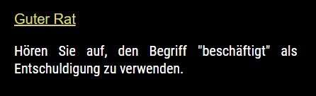

# MMM-Advice
Advice module for MM2 
 
## Examples

 

 

Works with your default language!! (You must set the title!)

## Your terminal installation instructions

* `git clone https://github.com/cowboysdude/MMM-Advice` into the `~/MagicMirror/modules` directory.`

**Go to MagicMirror/modules/MMM-Advice and run NPM INSTALL**

## Config.js entry and options
           {
	      	disabled: f,
            module: 'MMM-Advice',
            position: 'top_left',
             config: {
             showtitle: true,     //if you want to show title
			       title: "Good Advice"  //this is the title, showtitle must be set to true to use this.
					  }			
           }, 

